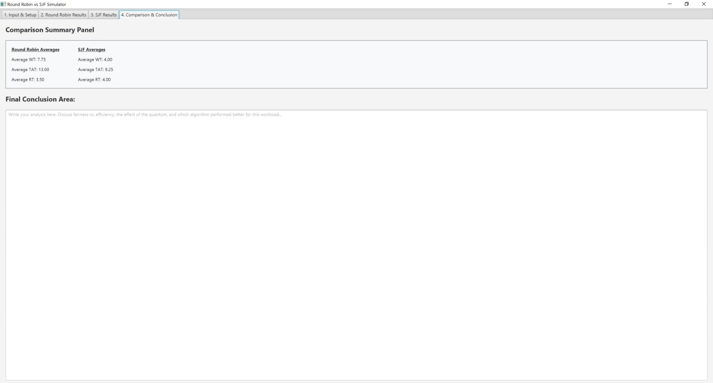
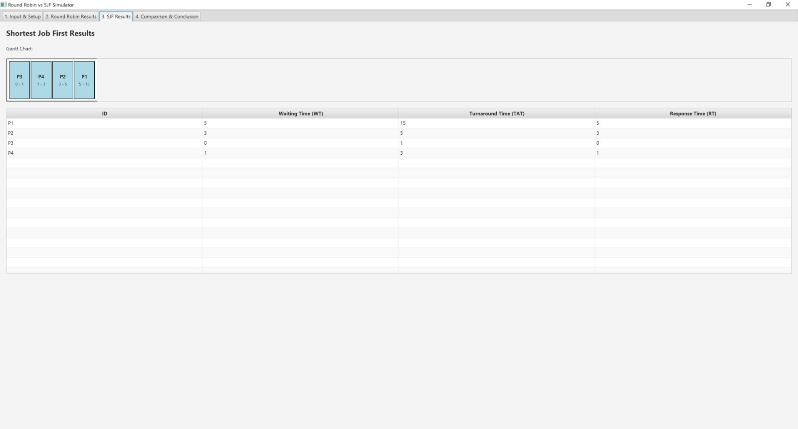
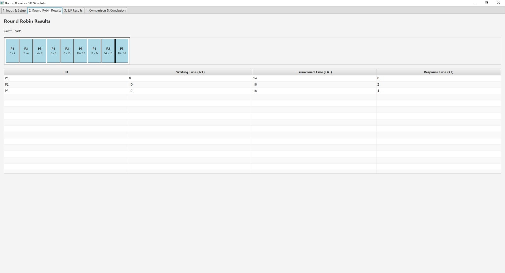
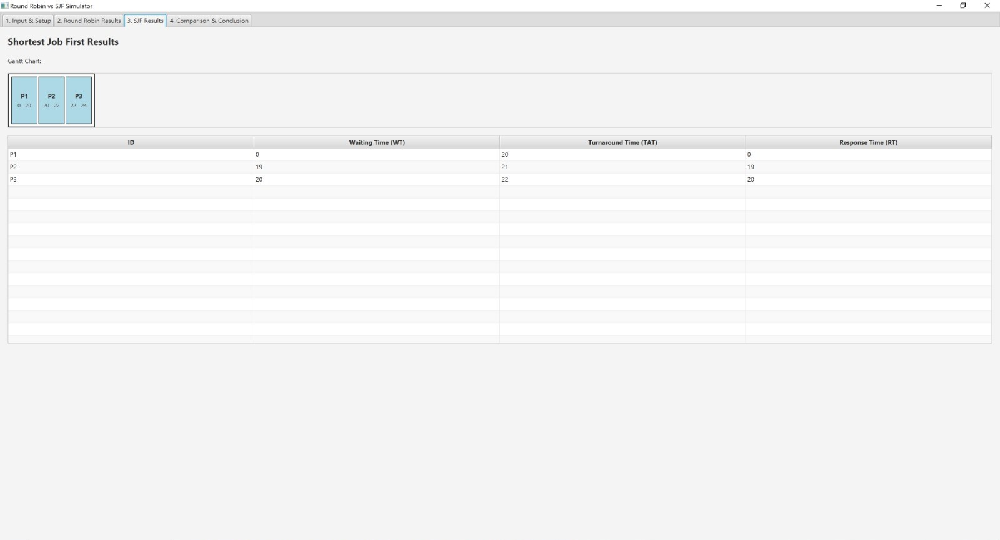
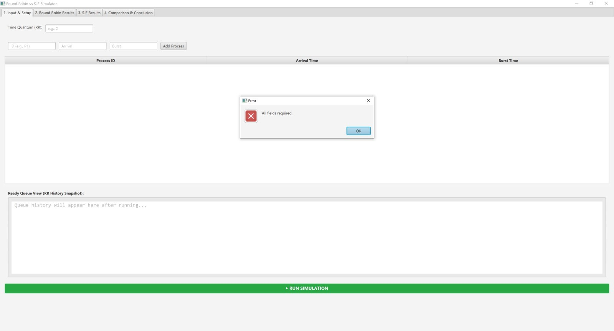
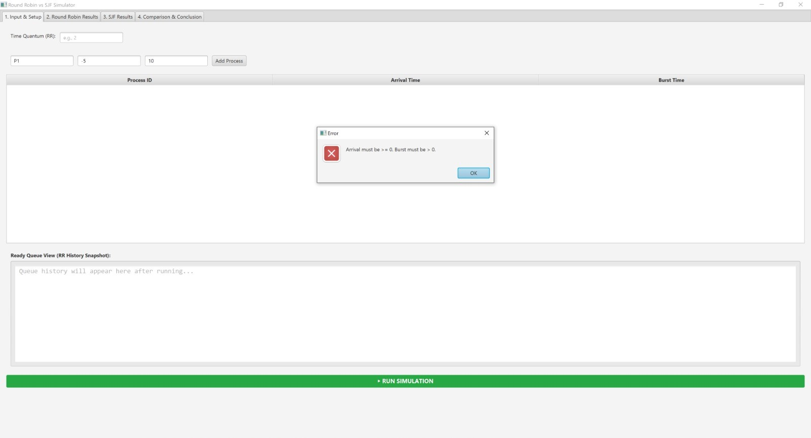
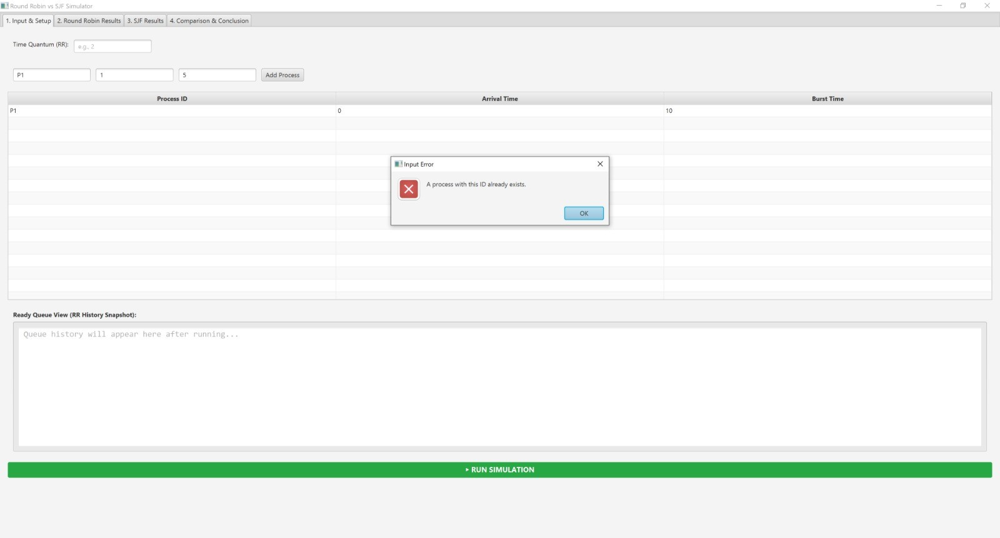

# 🖥️ CPU Scheduling Simulator: Round Robin vs SJF

## 📖 Project Overview
This project is a JavaFX-based graphical simulator designed to compare the performance and behavior of two fundamental Operating System CPU scheduling algorithms: **Round Robin (RR)** and **Non-Preemptive Shortest Job First (SJF)**.

The simulator allows users to input custom processes, validates the data, visualizes the execution via Gantt charts, and calculates key performance metrics (Waiting Time, Turnaround Time, and Response Time) to prove the theoretical tradeoffs between fairness and efficiency.

## ✨ Key Features
*   **Dual Algorithm Simulation:** Runs both RR and Non-Preemptive SJF simultaneously on cloned datasets for perfect 1-to-1 comparison.
*   **Dynamic Gantt Charts:** Automatically generates visual time-blocks for CPU execution.
*   **Live Ready Queue Snapshot:** Provides a second-by-second history log of the Round Robin queue rotation.
*   **Robust Input Validation:** Prevents crashes by blocking negative times, zero burst times, non-numeric characters, and duplicate Process IDs.

---

## 🧪 Required Test Scenarios

### Scenario A: Basic Mixed Workload (Control Test)
**Objective:** Establish a baseline of how both algorithms handle a normal mix of processes arriving at different times.
*   **Data:** Quantum = 4 | P1(Arr 0, Burst 5), P2(Arr 1, Burst 8), P3(Arr 3, Burst 2), P4(Arr 5, Burst 6)
*   **Result:** The system successfully routes tasks. SJF optimizes the queue by grabbing P3 (shortest) immediately after P1 finishes, while RR strictly cycles through the queue sharing the CPU.
    

### Scenario B: Short-Job-Heavy Case (Efficiency Test)
**Objective:** To demonstrate how SJF minimizes average waiting time by prioritizing shorter tasks.
*   **Data:** Quantum = 3 | P1(Arr 0, Burst 10), P2(Arr 0, Burst 2), P3(Arr 0, Burst 1), P4(Arr 0, Burst 2)
*   **Result:** SJF instantly identifies the tiny jobs (P3, P2, P4) and executes them immediately, drastically reducing the overall Average Waiting Time compared to Round Robin.
    

### Scenario C: Fairness Case (Interactivity Test)
**Objective:** To demonstrate how Round Robin prevents CPU starvation and shares resources fairly among identical jobs.
*   **Data:** Quantum = 2 | P1(Arr 0, Burst 6), P2(Arr 0, Burst 6), P3(Arr 0, Burst 6)
*   **Result:** Under SJF, P3 is starved and must wait 12 seconds to even start. Under Round Robin, the CPU is shared in a striped pattern, giving every process an excellent Response Time.
    

### Scenario D: The Convoy Effect (Long-Job Sensitivity)
**Objective:** To expose the primary weakness of Non-Preemptive SJF when a massive job arrives first.
*   **Data:** Quantum = 3 | P1(Arr 0, Burst 20), P2(Arr 1, Burst 2), P3(Arr 2, Burst 2)
*   **Result:** Under SJF, P1 grabs the CPU and refuses to let go, trapping the tiny P2 and P3 behind it for 20 seconds (The Convoy Effect). Round Robin solves this by pausing P1 after 3 seconds to let P2 and P3 finish rapidly.
    

### Scenario E: Input Validation
**Objective:** To prove the system gracefully handles user errors.
*   **Test:** Attempted to add a process with missing fields, negative arrival times, or duplicate IDs.
*   **Result:** System safely blocks execution and displays a user-friendly error dialog, preserving the integrity of the data structures.
    
    
    

---

## 📊 Final Analysis & Conclusion

1. **Which algorithm yielded the lower average waiting time?**
   Shortest Job First (SJF) consistently yields the lower average waiting time for grouped arrivals (as seen in Scenario B). By getting the shortest jobs out of the way immediately, it drastically reduces the time smaller processes spend sitting in the queue, driving the overall average down.

2. **Which algorithm yielded the lower average response time?**
   Round Robin is the clear winner for response time (as seen in Scenario C). Because it forces the CPU to switch contexts frequently based on the Time Quantum, no process is starved or forced to wait for a massive job to finish before getting its first turn. This makes RR ideal for interactive user interfaces.

3. **How does the Time Quantum affect Round Robin?**
   The Time Quantum is the defining factor of Round Robin. If the quantum is set too high (e.g., 100), the algorithm degrades into a basic First-Come-First-Serve (FCFS) system because every process finishes within its first turn. If the quantum is set too low (e.g., 1), the CPU spends too much overhead constantly pausing and swapping processes, severely impacting performance.